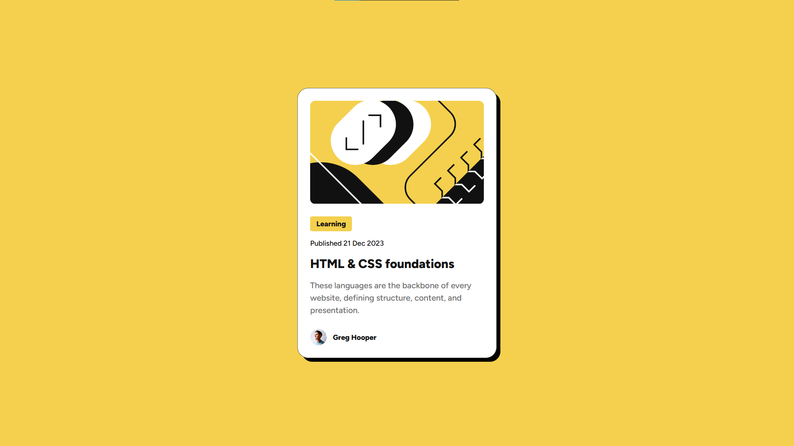

# Frontend Mentor - Blog Preview Card

## 📸 Screenshot

  

## 🔗 Links

- Live Site: https://hasanlashgari01.github.io/frontend-mentor-challenges/newbie/blog-preview-card/
- Solution: https://www.frontendmentor.io/solutions/blog-preview-card-with-html-and-css-Wz5D826z1P

## 🛠 Built With

- HTML5
- CSS3
- Flexbox

## 💡 What I Learned

- Semantic HTML
- Flexbox alignment
- CSS variables
