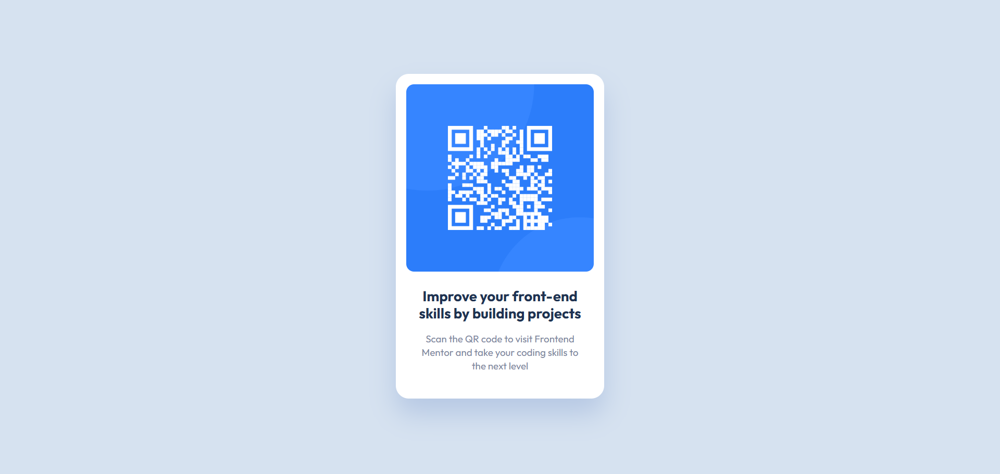

# Frontend Mentor - QR Code Component

## 📸 Screenshot

  

## 🔗 Links

- Live Site: https://hasanlashgari01.github.io/frontend-mentor-challenges/newbie/qr-code-component/
- Solution: https://www.frontendmentor.io/solutions/frontend-mentor-qr-code-component-NS18jcf6aM

## 🛠 Built With

- HTML5
- CSS3
- Flexbox

## 💡 What I Learned

- Semantic HTML
- Flexbox alignment
- CSS variables